# Open Abbott FreeStyle Libre 14 days Reverse

## Some history 

Lots of work has already be done on the hardware and sorftware reverse of the sensor. The most popular are:

[PIERRE VANDEVENNE's wiki](http://type1tennis.blogspot.com/2015/02/some-thoughts-on-using-freestyle-libre.html)


[UPeterson github with an analyse of the FRAM data](https://github.com/UPetersen/LibreMonitor/wiki)

[Humbertokramm hardware reverse and schematics](https://github.com/humbertokramm/FreestyleSensorLibre)


## Cleaning used sensor

Once the sensor expired, it's quite easy to remove the spike and the glue. 

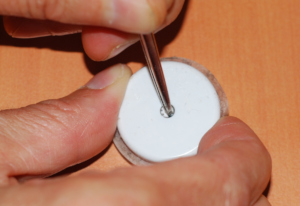 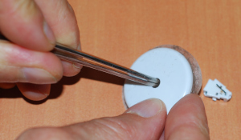 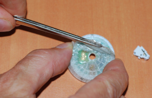 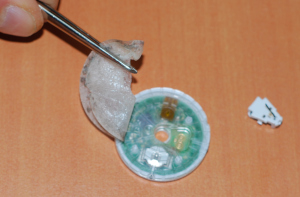

However, if a replacement of the battery is required by your new application, it demands more work as the plasic must be destroyed.

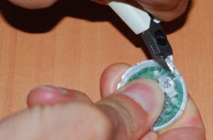 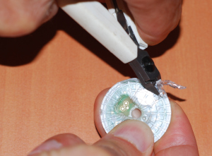  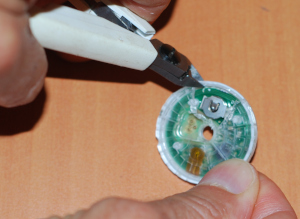 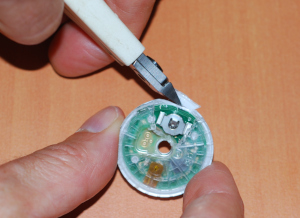

Then battery can be removed and replaced.

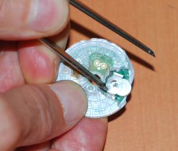 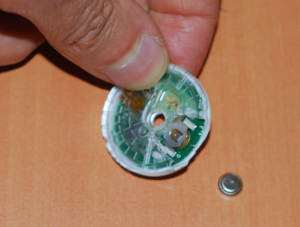 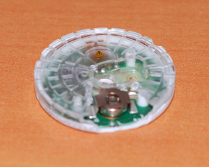


As shown by [Humberto Kramm](https://github.com/humbertokramm/FreestyleSensorLibre), two pads are available and should be reusable for any ADC application.


## Hardware part

As mentionned in Pierre Vandevenne's blog, the sensor chip (RF430TAL152H) seems to be a proprietary version of the public TI RF430FRL152.

Most of the pinout matches the RF430FRL152, some difference seems to appear in the ADC inputs pins.

## Software part

In order to re-use the sensor, we need to understand it's software architecture and to do this we need the complete code, or at least a complete binary dump.

### **FRAM dump**

Dumping the FRAM is relatively easy, with a smartphone (for those programming Android apps), or using a FTDI chip with [NXP PN8051 bord - PYPN8051](https://github.com/captainbeeheart/pypn5180)

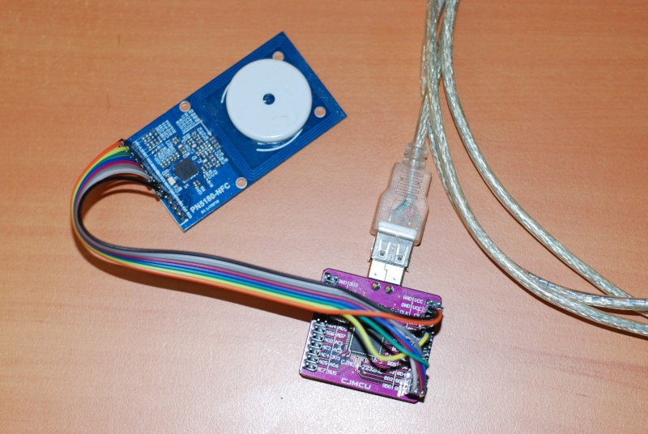

FRAM is organized in 5 sections

- Header section of 24 bytes
- Data section of 294 bytes
- Footer section of 22 bytes
- Patch code and Proprietary NFC functions section of 1558 bytes
- Interrupt vectors section

Each section (except interrupt vectors) starts with a 16bits CRC (refer to [UPeterson github](https://github.com/UPetersen/LibreMonitor/wiki) for CRC computation)

The following FRAM dump has been done on a new sensor, not yet activated.

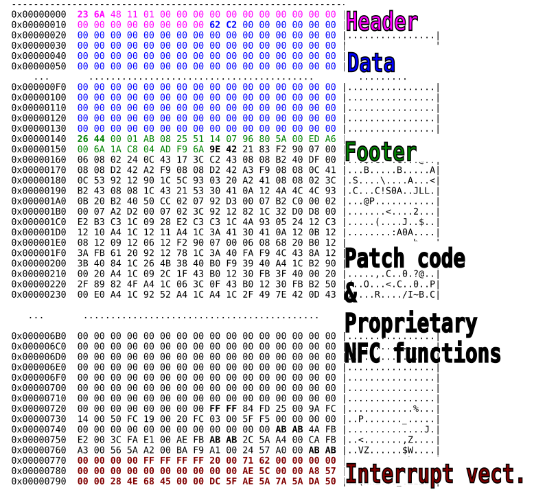


#### **Header section**

The header section holds some calibration data, the sensor state (Calibration, Working, Expired...) and an end of life structure that gives the expiration dates or in case of sensor malfucntion an error code.

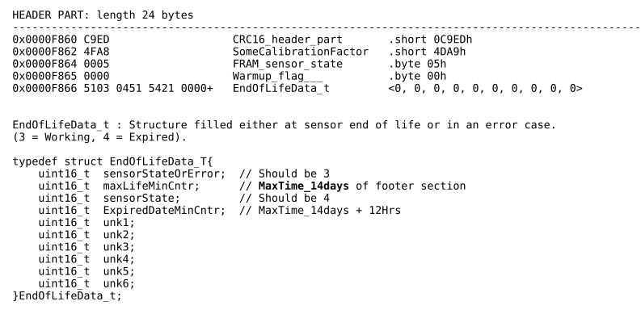


#### **Data section**

This section gives the glicemia measures, already explained in many sites and also handle the **main life time counter**. 

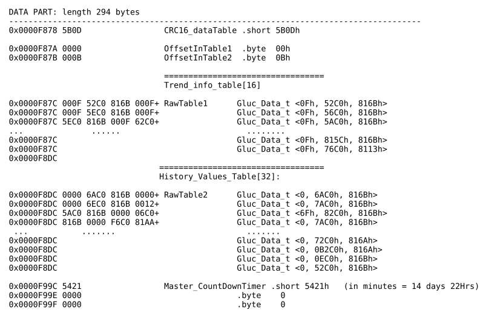


#### **Footer section**

Still lots of un-reversed data in this section, but a remarkable data is the 'factory' sensor maximum life time that varies from sensor to sensor. This value and should be calibrated regarding battery voltage at factory.

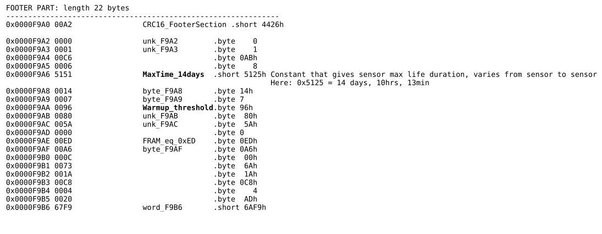


#### **Code section**

Most interesting part, the code section. This section is divided in 4 sub-sections.

- The patch code: It handles patch code to correct the ROM section bugs, but also functions that can be called by the RF interface (NFC custom functions). This part has already 974 bytes of patch code in it.
- Patch function pointer table: gives a function address in the FRAM and a table offset (exaplained later on).
- NFC Proprietary function table: gives a function offset either in ROM or FRAM and a NFC code (0xe0, 0xe1, 0xe2). Those functions cannot be accessed by NFC due to the 0xABAB at address 0xFFB8 (explained later)
- NFC Custom functions table: gives a function offset either in ROM or FRAM and a NFC code (0xa0, 0xa1...). Those fucntions can be called by NFC.

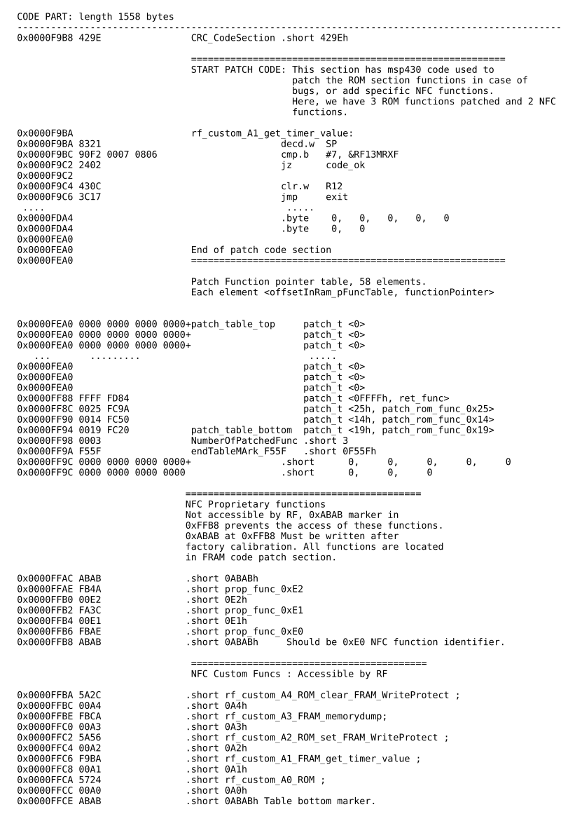


### Full chipset dump ??

As we start reversing the FRAM code section, there is quickly a lot of functions missing. Lots of call go to ROM or RAM section. To be able to fully re-use the sensor we need a full memory dump of the ROM and RAM. 

One of the FRAM NFC custom function will help a lot. The custom RF "0xA3" function seems to be, if correct patameters are sent, a memory dump function, without any address limitation in the 16bits address range.

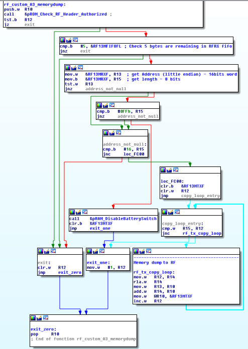


The issue here is that the first function called at the beginning "ROM_Check_RF_Header_Authorized" seems to lock the access to this function. Passing a correct length and base address to the function does not give any return....


### Radio interception and luck

Here comes the help of [pynfc15693demod](https://github.com/captainbeeheart/pynfc15693demod). This project is a SDR radio demodulator for NCF 15693 (Mobile phone to sensor).


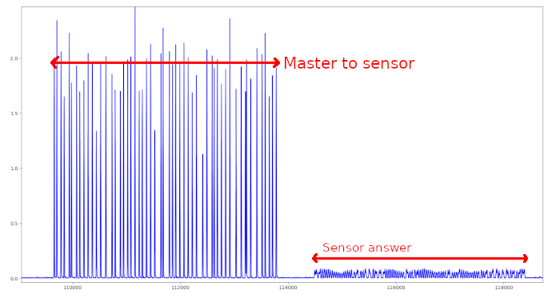

Radio interceptions have been done on new sensors, while the official Freestyle libre application was activating the sensor, using a SDRPlay SDR radio receiver.

Most of the frames sent by the phone are of type '0x01' inventory command with or without UID in the command , and two frames are specific to FreeStyle sensor.


NFC-15693 frame format is as follow:

```
 [1 byte Flags] [1 byte Command code][N data bytes related to command code][2 bytes CRC16]
```

The following interception has been done on multiple sensors, and it appeard that fix frames are sent to activate the sensor.
The application is sending custom command 0xA1, then reading the first 3 sections of FRAM, and finaly sends custom command 0xA0 with the same 32 bits sequence 0xC2, 0xAD, 0x75, 0x21.

```

   ['0x26', '0x1', '0x0', '0xf6', '0xa']                                                            0x01:Inventory command       
   ['0x26', '0x1', '0x0', '0xf6', '0xa']                                                            Multiple commands to check if multple sensors are present
   ['0x26', '0x1', '0x0', '0xf6', '0xa']                                                            and enable anti-collision UID verification
   ['0x26', '0x1', '0x0', '0xf6', '0xa']                                                                    ""
    ..................                                                                              ......................
   ['0x26', '0x1', '0x0', '0xf6', '0xa']                                                                    ""
   ['0x26', '0x1', '0x0', '0xf6', '0xa']                                                                    ""

   ['0x22', '0x2b', '0xxx', '0xxx', '0xxx', '0xxx', '0xxx', '0xxx', '0xxx', '0xxx', '0xxx', '0xxx']    0x2B: Get System Information 
                                                                                                          for Sensor UID: 0xxx 0xxx 0xxx 0xxx 0xxx 0xxx 0xxx 0xxx


   ['0x2', '0xa1', '0x7', '0xec', '0xb1']                                                           0xA1: ABBOTT proprietary command, No extra data
                                                                                                        0x07                   : TI Manufacturer ID

   ['0x2', '0x23', '0x0', '0x2', '0xe5', '0xa']                                                     0x23: READ 3 blocks offset 0x00
   ['0x2', '0x23', '0x3', '0x2', '0x8d', '0x20']                                                    0x23: READ 3 blocks offset 0x03
   ['0x2', '0x23', '0x6', '0x2', '0x35', '0x5e']                                                    0x23: READ 3 blocks offset 0x06
   ['0x2', '0x23', '0x9', '0x2', '0xfd', '0xdd']                                                    0x23: READ 3 blocks offset 0x09
   ['0x2', '0x23', '0xc', '0x2', '0x45', '0xa3']                                                    0x23: READ 3 blocks offset 0x0C
   ['0x2', '0x23', '0xf', '0x2', '0x2d', '0x89']                                                    0x23: READ 3 blocks offset 0x0F
   ['0x2', '0x23', '0x12', '0x2', '0xc4', '0xac']                                                   0x23: READ 3 blocks offset 0x12
   ['0x2', '0x23', '0x18', '0x2', '0xb4', '0x51']                                                   0x23: READ 3 blocks offset 0x18
   ['0x2', '0x23', '0x1e', '0x2', '0x64', '0x5']                                                    0x23: READ 3 blocks offset 0x1E
   ['0x2', '0x23', '0x21', '0x2', '0xb6', '0x4e']						                            0x23: READ 3 blocks offset 0x21
   ['0x2', '0x23', '0x24', '0x2', '0xb6', '0x4e']						                            0x23: READ 3 blocks offset 0x24
   ['0x2', '0x23', '0x27', '0x2', '0xde', '0x64']                                                   0x23: READ 3 blocks offset 0x27
   ['0x2', '0x23', '0x2a', '0x0', '0xb4', '0xf7']                                                   0x23: READ 1 block  offset 0x2A

   ['0x26', '0x1', '0x0', '0xf6', '0xa']                                                            0x01:Inventory command
   ['0x26', '0x1', '0x0', '0xf6', '0xa']                                                                    ""
    ..................                                                                              ......................
   ['0x26', '0x1', '0x0', '0xf6', '0xa']                                                                    ""  

   ['0x2', '0xa0', '0x7', '0xc2', '0xad', '0x75', '0x21', '0x25', '0x47']                           0xA0: ABBOTT proprietary command Parameters: 
                                                                                                        0x07                   : TI Manufacturer ID
                                                                                                        0xC2, 0xAD, 0x75, 0x21 : Data 

   ['0x26', '0x1', '0x40', '0xxx', '0xxx', '0xxx', '0xxx', '0xxx', '0xxx', '0xxx', '0xxx', '0xxx', '0xxx'] 0x01:Inventory command with 64bits (0x40) mask + sensor UID 0xxx 0xxx 0xxx 0xxx 0xxx 0xxx 0xxx 0xxx
   ['0x26', '0x1', '0x40', '0xxx', '0xxx', '0xxx', '0xxx', '0xxx', '0xxx', '0xxx', '0xxx', '0xxx', '0xxx']   ""
    ..................                                                                              ......................
```

This is where luck operates. Remember the custom memory dump function 0xA3?
Adding the fix 32bits sequence of comand 0xA0 before the address and length parameters unlocked the function, letting us having a full reading access to the memory!

So sending the following sequence by NFC operates a memory dump:
```
 ['0x2', '0xa3', '0x7', '0xc2', '0xad', '0x75', '0x21', [2bytes address Little endian], [1 byte word count], [2 bytes CRC16]]

 - 0x2  : Flags
 - 0xa3 : command code
 - 0x07 : Manufacturer ID (TI)
 - 32bits magic
 - 2 bytes read address
 - 1 byte Word count [0..15]
 - 2 bytes CRC16

```

**From that point, it's easy to dump the complete content of RAM, ROM and memory mapped registers from address 0x0000 to 0xFFFF, and enable us to reprogram the sensor board and give it a second life !**