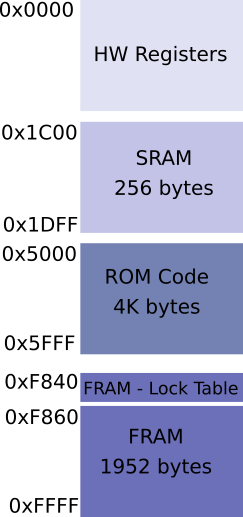
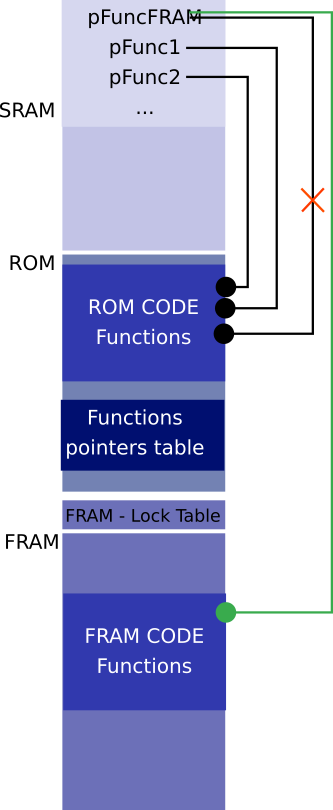

# Sensor software architecture

## Memory mapping

To understand OpenFreeStyle framework let's start by the chip overall memory mapping:

We can see here 4 different memory types :

- Regsiters: All the registers of the chip are memory mapped and can be read/write directly
- SRAM: A small volatile memory that holds data but also a table of function pointers used as a ROM bug fix. In order to fix a ROM bug, function is added in the FRAM and the boot loader scans the FRAM Patch table at boot to overwrite function pointers (see image below). This method if often used when providing ROM based applications in order to provide software patch ability without the need to make a new chip mask that costs money...
- ROM: Handles all the code and static data
- FRAM Lock table: Is part of the FRAM but not accessible from NCF interface. This table is a bit field read/write access for FRAM blocks. Controlling this table enables or disables write access to FRAM.
- FRAM: Kind of flash memory accessible by NFC interface.

